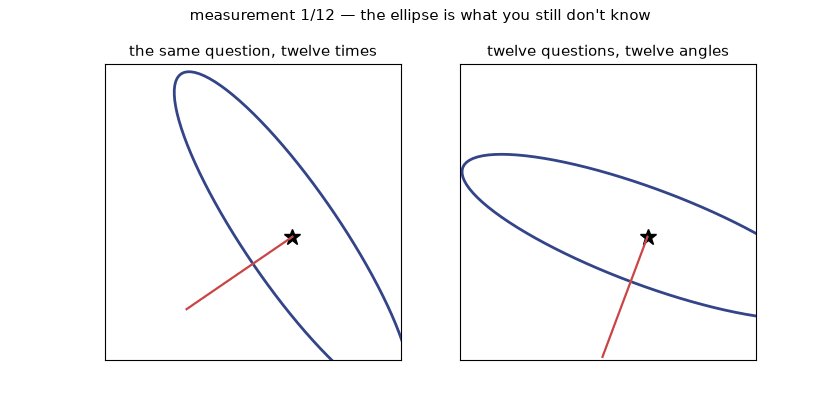
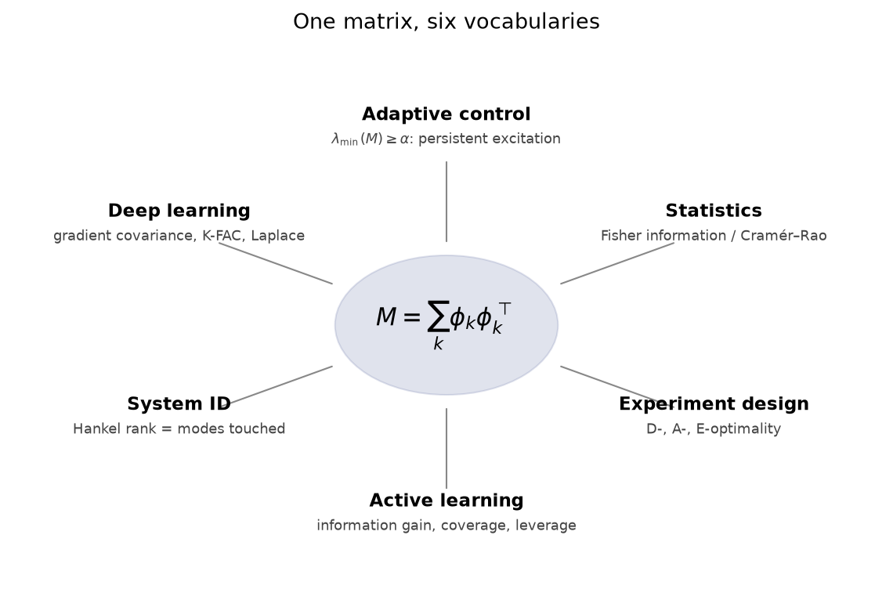
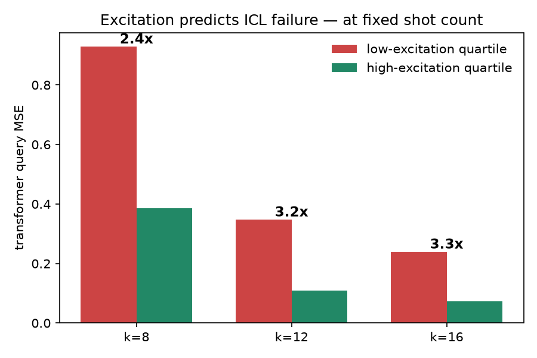
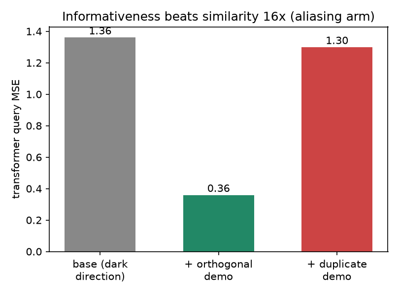
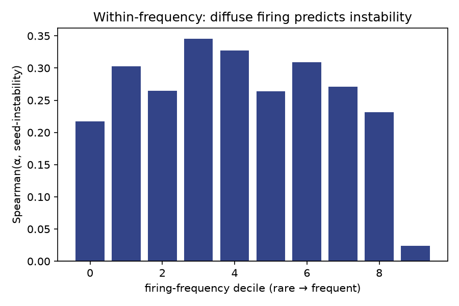
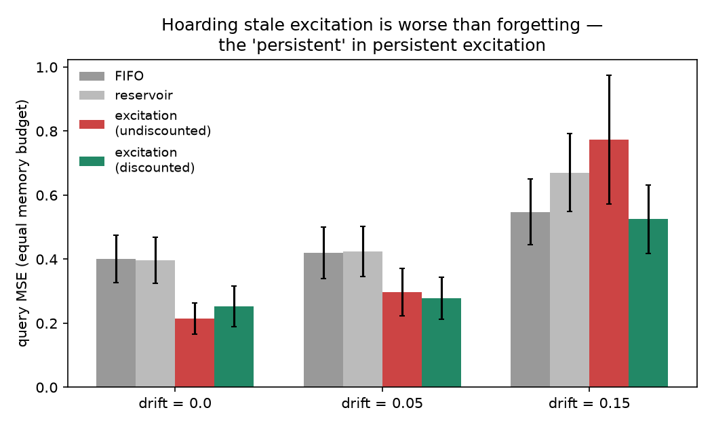

# Persistency of Excitation: The Geometry of Asking Good Questions

*Draft v2 — published. Source of truth for the Notion page; republish via publish_notion.py.*

---

## 1. A confession from the track

I met persistency of excitation before I knew its name, and it was wearing a Nyquist
costume at the time. At Magway I worked on control for an electrodynamic carriage
system — vehicles surfing magnetic fields down a track. In motion the carriages produced
almost pure sinusoidal waveforms, and part of my job was making sure our sensing was
granular enough to actually capture them.

I assumed for a while that this was the whole story of knowing a system: measure often
enough and the truth arrives. Then I spent months designing experiments to make our
physical rig confess dynamics that our simulations swore it had, and learned the harder
lesson. You can sample a system at absurd rates and still learn nothing, because the
system only answers what you ask, and we had been asking one question with great
frequency and enthusiasm. Somewhere in the adaptive-control literature this failure has
been a theorem for sixty years, with the least glamorous name in applied mathematics:
**persistency of excitation**. Nyquist is about sampling often enough. Its
less-famous cousin is about asking *differently* enough — coverage of state directions
rather than coverage of time. Same geometry, different space; we'll make that precise
later.

The everyday version is familiar to anyone who has tried to get to know a person.
You do not learn much by asking whether they like food. You learn by asking the question
whose answer you can't predict — what they'd defend in an argument, what they'd do with
an unscheduled Tuesday. You are looking, quite literally, for what excites them, and
each answer tells you which deeper question is now worth asking. Everyone runs this
algorithm socially. Control theory wrote it down, proved when it converges, and then
mostly kept it to itself.

This essay takes that theorem for a walk through machine learning — prompts, features,
exploration — and reports honestly on the walk, including the three occasions on which
the theorem bit me. The bites are the useful part.

## 2. The whole idea, from one equation

Suppose something you care about is governed by unknown parameters
$\theta = (\theta_1, \theta_2)$, and each observation gives you one linear glimpse:

$$y = \phi^\top \theta$$

where $\phi$ is whatever you measured alongside the outcome. One observation is one
equation in two unknowns: a line of candidate explanations, not an answer. A second
observation pins it down — unless your second $\phi$ points the same direction as the
first, in which case you have asked the same question twice and received the same
information once. Ten thousand further observations along that direction will not help.
This is worth sitting with: the sample count is not the currency. The *directions* are.

The bookkeeping object is the **information matrix** $\sum_k \phi_k \phi_k^\top$ — a
running record of which directions have been probed and how hard. Its smallest
eigenvalue is your worst-illuminated direction: the question you have most neglected.
And the "persistency" part is the sharpest clause in the definition. It requires that
**every window** of recent data stay well-conditioned,

$$\sum_{k=t}^{t+N} \phi_k \phi_k^\top \;\succeq\; \alpha I \quad \text{for all } t,$$

because any learner that adapts also forgets, and the rich data you supplied last year
does not excuse the monotone diet you are feeding it now. The picture to keep: the
unknown $\theta$ is an object in a dark room, each measurement a torch beam from one
angle. From a single angle, many shapes cast identical shadows. Learning is not the
accumulation of light. It is the accumulation of *angles*.

*Twelve measurements, two interrogation styles. Left: the same question repeated — the posterior stops shrinking along the unasked direction. Right: varied angles — the ellipse collapses. Sample count identical.*

## 3. The ladder of generality

The equation above looks aggressively linear. The idea is not; it climbs.

**Rung one: linear.** The regressor $\phi$ is the information carrier, and everything
reduces to the rank story above.

**Rung two: nonlinear.** Let $y = f(\theta, u)$. Each observation now carves a curved
surface through parameter space, and the local information carrier becomes the
sensitivity $J = \partial f / \partial \theta$ — which in the linear case is exactly
$\phi$. The information matrix becomes $\int J^\top J\,dt$, at which point a statistician
will point out, correctly, that this is **Fisher information** and has been since 1925.
Persistency of excitation for nonlinear systems is the demand that the Fisher information
stay uniformly positive definite along your trajectory — no parameter direction leaves
the conversation. Where even local sensitivity fails, the right notion becomes
identifiability proper: can two different $\theta$'s produce identical outputs under the
inputs you actually applied? If yes, no estimator can save you, and the failure was
chosen when you chose the inputs.

**Rung three: function space.** For neural networks, parameter space is the wrong room
to illuminate. Permute two hidden neurons: identical function. Rescale through a ReLU:
identical function. Enormous tracts of parameter space are pure gauge, which is why
networks tolerate savage pruning without complaint. The object that matters is the
network's function-space geometry — what the model can *distinguishably do* — and the
honest excitation question becomes: has the data excited every functionally distinct
direction the task cares about? This rung is younger, less settled, and where I think
the interesting problems live.

## 4. One matrix, many franchises

Here is the part I find genuinely satisfying. Take
$M = \sum_k \phi_k \phi_k^\top$ and tour the neighboring fields:

- **Adaptive control** calls $\lambda_{\min}(M) \geq \alpha$ *persistent excitation* and
  pays out exponential parameter convergence.
- **Statistics** calls $M$ *Fisher information* and its inverse the Cramér–Rao floor:
  worst-excited direction, worst-estimable parameter, exactly.
- **Optimal experiment design** has spent decades shaping $M$ on purpose: maximize its
  determinant (D-optimal), minimize its trace-inverse (A-optimal), or raise its smallest
  eigenvalue (E-optimal) — that last criterion simply *is* the excitation constant with
  a budget attached (Kiefer, 1959).
- **Active learning** scores an unlabeled point by how much it would grow $M$: information
  gain, coverage, leverage — the same ledger, new accent.
- **System identification** stacks time-shifted data into a Hankel matrix and reads its
  rank as the number of dynamical modes the data actually touched (Ho–Kalman; Willems'
  fundamental lemma is a persistent-excitation statement). In the frequency domain, PE of
  order $n$ means the input carries $n$ distinct spectral lines. A model with $n$
  parameters requires a song with $n$ notes; this is also the precise form of the
  Nyquist kinship promised earlier — both are statements that your observations must
  span the relevant space; they just disagree about which space.
- **Deep learning** meets $M$ as the gradient covariance / empirical Fisher, load-bearing
  in natural gradient, K-FAC, and Laplace approximations, usually without anyone
  mentioning control theory, which is fine, control theory is used to it.

Six fields, one positive-semidefinite matrix, six vocabularies for "which questions has
the data asked." I want to be careful about what kind of claim this is: not a metaphor
connecting fields, but a literal shared object whose theorems transfer. That is the
right kind of beauty. It is also a warning label, and Section 6 is about the day I read
it properly: if your exciting new ML idea lives entirely inside this table, one of these
six fields owns it already and has since before you were born.

## 5. Compression's active twin

There is a seventh face, and it is the one that connects my two research obsessions.
The minimum-description-length principle says: prefer the hypothesis that compresses
your observations best. It is a complete philosophy of what to believe and a total
non-answer on what to *look at* — MDL ranks explanations and sits there. Compression
is passive.

Excitation is the missing half. In Bayesian terms, the expected information gain of an
experiment equals the expected reduction in posterior code length, so choosing the most
informative experiment *is* choosing the observation that shortens your future
description fastest. Greedy "active MDL" turns out to be classical Bayesian experiment
design — Lindley worked this out in 1956, and every generation since has rediscovered it
with better logos. Twenty questions is the folk algorithm: a good question compresses
the remaining hypothesis space by about a bit regardless of the answer.

What is genuinely not classical is the structured version. MDL is most interesting over
two-part codes — model class plus residual, abstractions plus exceptions — and I know of
no satisfying account of *excitation over abstractions*: which observation most
reorganizes the structural part of your code, rather than the parameters within it?
My parallel work on program-induction approaches to abstract reasoning lives in that
structured-code world, and the synthesis — an agent that acts to shorten its own
structured description of the world — is, as far as I can tell, still unclaimed. I flag
it as a question rather than a result, an act of restraint the rest of this essay will
explain.

## 6. Where the analogy breaks: three scars

Everything so far is the enthusiast's tour, and enthusiasm is cheap. Over recent months
I ran these ideas through a deliberately adversarial process — pre-registered kill
criteria, prosecution-and-defense theory gates, and a scheduled audit of my own past
conclusions ([paper trail](../process/)). Three lessons survived. Each one killed
something I was fond of.

**Scar one: the circularity trap.** My first "excitation theory of in-context learning"
scored a prompt by $\lambda_{\min}(P^\top M_S P)$ and predicted ICL error from it via a
ridge-regression bound. The theory gate dispatched it in one sentence: that bound *is*
the ridge estimator's own posterior variance, restated. I had built an elaborate machine
for predicting a quantity from itself. The trap generalizes and is worth stating
plainly: any excitation score derived from your model's own uncertainty machinery will
"predict" that machinery's behavior perfectly and tell you nothing about the world. An
excitation claim earns its keep only when the predicted quantity is measured
*independently* of the score. Every experiment in Section 7 is built around that rule,
for reasons that are no longer theoretical to me.

**Scar two: the classical wall.** Take excitation to few-shot example selection:
"choose demonstrations that excite the task subspace." This sounds novel. It is
E-optimal experiment design, 1959, wearing a lanyard. The audit's verdict on my static
few-shot theory was blunt: static excitation questions collapse into optimal design,
where sixty years of literature have mined the scalar criteria to bedrock. What the
classical field does *not* own is the sequential structure — windows, ordering,
forgetting, closed loops: the *persistent* in persistent excitation. That distinction
reshaped my entire research program, and I pass it on as the cheapest available
inheritance: the static questions are taken; the sequential ones are open.

**Scar three: you cannot out-excite Bayes from inside the model class.** I spent a
month on a hypothesis I still think was pretty: that one could design excitation toward
*model-class error* — the part of reality your hypothesis space cannot represent, which
the posterior does not self-report. Built the closed-form study, ran the controls,
watched it die. The effect exists and is exactly classical robust experiment design,
split along the standard minimax-versus-Bayes axis
([full autopsy](../experiments/spearhead_b/RESULTS.md)). The moral: within a
linear-Gaussian world with free design, there is no secret excitation channel that
beats the posterior at its own game. If misspecification-seeking excitation exists, it
lives in sequential, capacity-constrained, nonlinear regimes, and the burden of proof is
on the claimant. The corpse stays on display because the field publishes too few of
them, and because I remain slightly proud of it.

## 7. What survives, with receipts

The same discipline, pointed at claims that lived. Each follows the same micro-arc:
derive the object in one line, pre-register what it must do, then look.

**7a. A label-free failure diagnostic for in-context learning.**
*Derive:* if ICL behaves like regression in some feature space, worst-case error on a
task subspace $P$ is controlled by $1/\lambda_{\min}(P^\top G P)$, with $G$ the prompt's
Gram matrix — so a purely input-side score, needing no labels and no logits, should
bound where ICL cannot succeed. *Pre-register:* the score must survive shot-count
deconfounding (adding examples mechanically inflates any $\lambda_{\min}$); must beat
its unprojected version; and must work with $P$ *estimated* from a handful of probe
tasks rather than oracle-given. *Look:* on a trained ICL transformer, prompts in the
worst excitation quartile carry roughly **3× the error** of the best quartile at fixed
shot count; the projected score wins every slice (the unprojected one is provably
degenerate when shots < dimension); and the probe-estimated subspace matches the oracle
to three decimal places ([results](../experiments/spearhead_a/A3_VERDICT.md)).
Disclosures: per-query, classical Bayes predictive variance — which needs the query and
the prior — beats the excitation score, exactly as pre-registered; the instrument's
honest niche is the query-agnostic certificate. An earlier version of this experiment
reported 4.88×; my own audit found that number confounded with shot count, and the
deconfounded 3× replaced it. The audit is in the repo. So is the 4.88×.

**7b. Informativeness is not similarity, by a factor of sixteen.**
*Derive:* a near-duplicate demonstration adds zero new rank to $G$; a demonstration
along an unprobed task direction adds an entire eigendirection. Retrieval-by-similarity
is structurally blind to this distinction; excitation *is* this distinction. *Pre-register:*
with one task direction left dark, an informative demo should cut error sharply; a
maximally similar demo should do approximately nothing — at identical shot count.
*Look:* error 1.36 → 0.36 for the informative demo; 1.36 → 1.30 for the duplicate. A
**16× difference in improvement**, called in advance by $\Delta\lambda_{\min}$
([results](../experiments/spearhead_a/A3_ALIASING.md)). This is the cleanest three-bar
summary of the whole thesis: your prompt does not need more relevant examples; it needs
unasked questions. The same run also returned a tidy negative — an attention-dilution
"budget" mechanism I once considered my central idea did nothing measurable, and is
retired with data rather than regret.

**7c. The experiment that said no, and said something better.**
One more finding from 7a first: low excitation predicts the transformer's *excess* error
over the Bayes-optimal answer computed on the same prompt. Degenerate prompt geometry is
not merely hard; it is specifically where the learned inference algorithm parts company
with Bayes. The SAE pilot took that logic up a level: treat each sparse-autoencoder
feature as a parameter and the data where it fires as its excitation, and predict that
features with degenerate exciting data are the ones that wander across training seeds —
interpretability's known reliability problem, assigned a control-theoretic cause. I
pre-registered it with a frequency-matched control and trained five seed-varied SAEs on
GPT-2 activations. **The prediction failed, sign flipped, robustly:** at matched
frequency it is the *diffusely* firing features that are unstable (partial
$\rho = +0.26$, positive in ten of ten frequency deciles, split-half replicated;
[verdict](../experiments/e1_sae/E1_VERDICT.md)). The data was correcting my ontology,
and I am inclined to let it. An SAE feature is not a regression parameter, whose
estimate sharpens with richer excitation. It behaves like a *decomposition component*,
whose identifiability comes from separation: tight, distinctive firing regions get
rediscovered by every seed; diffuse regions get tiled differently every time. That is
precisely the boundary between the two faces of excitation theory — Gram conditioning
versus uniqueness of decompositions — located empirically, in a real model, by a
falsified prediction. The instrument survives with its sign corrected: a label-free
score, computed from activation geometry alone, that flags which interpretability
features not to trust. Alongside it sits a proposal I have deliberately not built:
prompt-*order* sensitivity as a failure of uniform observability, test specified before
any result exists ([proposal](../experiments/b4_ordering/PROPOSAL.md)).
Pre-registration cuts both ways. Section 7c is what it looks like when it cuts me.

**7d. Postscript: the word "persistent," earning its keep.** After this essay was first
published, two more pre-registered tests ran. One died on schedule: a windowed-
observability account of prompt-order sensitivity was killed by its own criterion —
the model is massively order-sensitive and no excitation functional predicts any of it
([verdict](../experiments/b4_ordering/B4_VERDICT.md)); the corpse says order sensitivity
is not excitation geometry, at least at this scale. The other is the cleanest positive
in the repo. Stream demonstrations past a model with a fixed memory budget and ask what
to evict. Curating memory to keep the retained set *exciting* halves error against
recency at equal budget — classical concurrent learning, transplanted, working. But let
the task drift, and the undiscounted version becomes **worse than naive recency**: it
hoards memories that were maximally informative about a task that no longer exists.
The time-discounted variant — the one that takes the *every-window* clause seriously —
degrades gracefully and wins ([verdict](../experiments/a5_streaming/A5_VERDICT.md)).
That is the difference between informativeness and persistent excitation, measured: an
agent's memory should be curated for what keeps the *present* identifiable, and Section
2's window condition turns out to be the design principle, not the fine print.

## 8. The frontier: excitation inside the model

Everything above treats the model as the subject of excitation. The questions I most
want to work on next turn the lens around.

**Capacity as an excitation budget.** Recent interpretability work at Anthropic finds
that language models route a privileged handful of concepts — order tens, not thousands —
through a small, flexible, verbally-reportable workspace, read out via a *Jacobian*
lens. A reader of Section 3 will recognize the Jacobian as the nonlinear-PE information
carrier; the recognition is mutual whether or not anyone intended it. A capacity-limited
workspace is, in excitation language, a bound on simultaneous excitation rank: tasks
requiring more concurrently-identified modes than the budget should fail in a
characteristic, predictable way — an excitation-order ceiling for reasoning. I state
this as a question rather than a result, partly out of principle and partly because my
own toy-scale probe of a budget effect came back negative, which is the sort of detail
one is tempted to omit and therefore must not. The twin question: are the workspace's
concepts *identifiable* — is each one pinned down by the contexts that excite it? That
is the SAE-stability question of Section 7c, asked one floor up.

**When should a model make up its mind?** A model holding contradictory stances in
superposition is, in estimation terms, an unresolved posterior — and PE theory says
beliefs collapse along a direction exactly when that direction gets excited. For a
language model, the discriminating experiment need not be external data: chain-of-thought
on a counterintuitive claim is *self-excitation* of the discriminating direction. The
design principle this suggests might be called calibrated decisiveness: commit when the
discriminating direction can be excited — by evidence, retrieval, or derivation — and
stay honestly uncertain when it cannot. Note the corollary about what should *never*
excite a stance direction: social pressure. Sycophancy, restated as an
excitation-hygiene violation, becomes a measurable property rather than a vibe.

**Oversight as dual control.** Dual control — act so as to perform *and* to remain
identifiable — is adaptive control's oldest dilemma. An aligned model under oversight
faces its mirror image: behave so that your overseer's data about you remains
persistently exciting, so that what you are stays identifiable from what you do. I do
not know how far this framing carries. It is the question on this list I would most
like the excuse to pursue properly.

## 9. Coda

One matrix, and one discipline. The matrix counts the questions your data has asked.
The discipline is declining to believe your own enthusiasm until the object has survived
an honest attempt on its life — the graveyard sections above did more for the surviving
claims than any success did. Code, pre-registrations, audits, corpses and results are
all in [the repository](https://github.com/Haksaw22/PE-ML), arranged so that you can check
me. I would summarize the whole essay as follows: ask questions whose answers you cannot
predict, keep asking them from new directions, and when reality answers with a sign flip,
consider the possibility that it is telling you what your object actually was.
